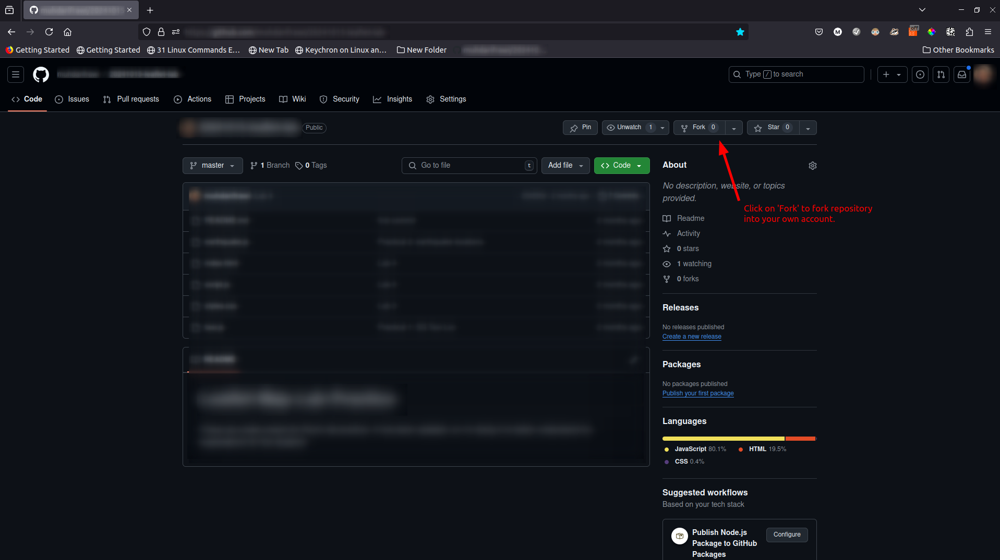

# JavaScript Practice Questions Set 1
## Instructions
### Warning
Do not clone this repository before forking into your own GitHub account. 

### Setting Up
Fork this repository into your own GitHub account. After forking, clone or download
the forked repository into your local machine.



Before starting the questions, you will need to run the following code:
```
npm install
```

This will install the necessary packages to run the tester.

### Answering the questions
Answer the questions in the respective JavaScript(JS) files that has been created
for each questions. 

Example: question 1 should be answered in `question-01.js`.

### Checking your answers
To check your answers, open up the integrated terminal and run the following code:
```
npm test
```

The auto tester will check your answer and let you know which questions you 
got wrong. 


## Practice Questions
### Question 1
